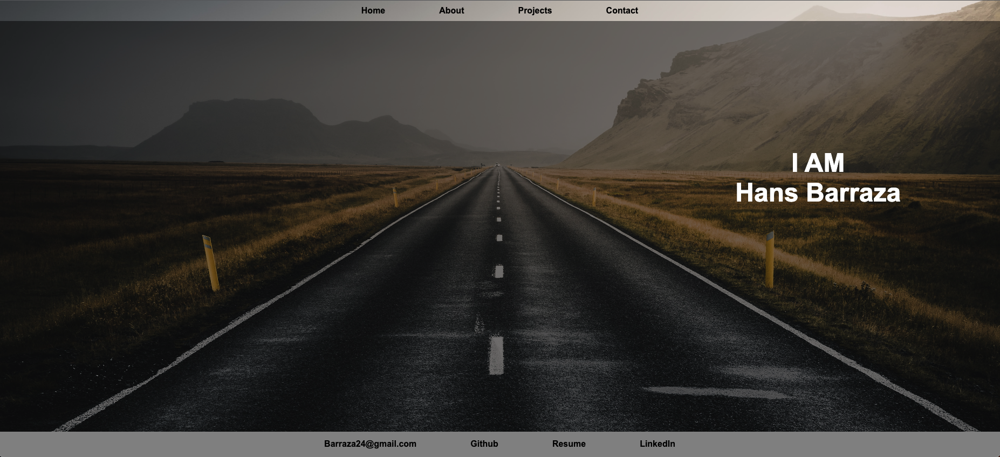

# React Portfolio

## Description

The React Portfolio is a web application that allows you to create a personal portfolio website to showcase your projects, skills, and experience. It is built using React, a popular JavaScript library for building user interfaces, and follows modern web development practices. With this portfolio website, you can customize and showcase your projects, provide information about yourself, your skills, and your contact information. The website provides a visually appealing and responsive user interface that can be easily accessed from different devices, including desktops, tablets, and mobile phones.

## Features
- Responsive portfolio website.
- Customizable sections for projects, skills, and contact information.
- Easy-to-use and intuitive user interface.
- Built using React, a popular JavaScript library for building user interfaces.
- Follows best practices for modern web development.

## Technologies

The React Portfolio is built using the following technologies:

- React: A popular JavaScript library for building user interfaces.
- ReactDOM: A package for rendering React components in the DOM.
- HTML5: The latest version of HTML for structuring the web pages.
- CSS3: The latest version of CSS for styling the web pages.